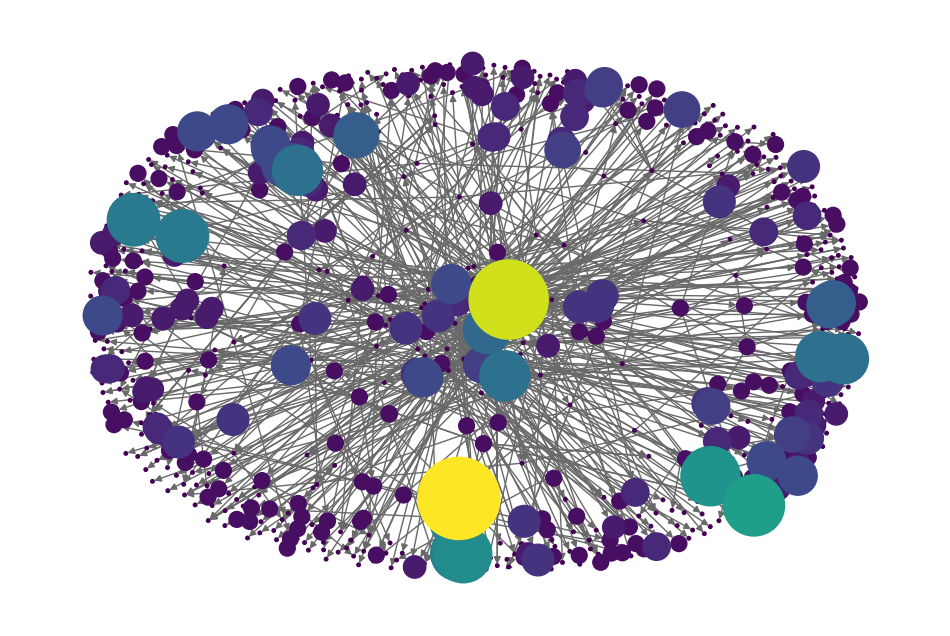

# sna-dw

Social Network Analysis applied to Data Warehouses.

The discreteness of the entities and the binarity of the relationships are what matters
for network analysis ([Zinoviev, 2018][Zin18]). Each circle in the above picture
represents a table as a discrete entity that is separable from all other tables in a
given data warehouse. Each arrow represents a relationship involving two discrete
entities. The graphical representation leverages the nodes' out-degree attribute to
highlight outstanding nodes and express how different the nodes are according to this
metric.

[Zinoviev (2018)][Zin18] also states that a complex network has a non-trivial structure.
It is not a grid, not a tree, not a ring—but it is not entirely random, either. Complex
networks emerge in nature and the man-made world as a result of decentralized process
with no global control. One of the most common mechanisms is the preferential attachment
(_[Emergence of Scaling in Random Networks][BA99]_), whereby nodes with more edges get
even more edges, forming gigantic hubs in the core, surrounded by the poorly connected
periphery. Such a behavior can be observed in the above picture, not only by the size of
the nodes but also by the density of overlapping edges in some areas of the chart.

[BA99]: https://doi.org/10.1126/science.286.5439.509
[Zin18]: https://pragprog.com/titles/dzcnapy/complex-network-analysis-in-python/
